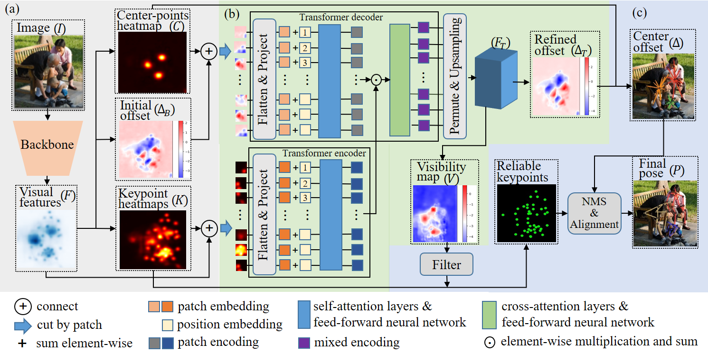

# Globally-Robust Instance Identification and Locally-Accurate Keypoint Alignment for Multi-Person Pose Estimation (ACM MM 2023)

This is the offical repo of GRAPE
[[`Paper`](https://openaccess.thecvf.com/content/CVPR2022/papers/Wang_Contextual_Instance_Decoupling_for_Robust_Multi-Person_Pose_Estimation_CVPR_2022_paper.pdf)]
[[`Project page`](https://grape2dpose.netlify.app)]
 
<p align="center">

<p>

---

## Environment

```shell
Ubuntu: 20.04
Python: 3.8
CUDA: 11.3
Pytorch: 1.12.1
We use 4 NVIDIA RTX A6000 GPUs for training
```

## Installation

### 1. Clone code
```shell
    git clone https://github.com/????
    cd ./????
```
### 2. Create a conda environment for this repo
```shell
    conda create -n grape python=3.8
    conda activate grape
```
### 3. Install PyTorch >= 1.12.1
```shell
    conda install pytorch==1.12.1 torchvision==0.13.1 torchaudio==0.12.1 cudatoolkit=11.3 -c pytorch
```

### 4. Install other dependency python packages
```shell
    pip install -r requirements.txt
```
### 5. Install API
   1. Install [COCOAPI](https://github.com/cocodataset/cocoapi)
   and [CrowdPoseAPI](https://github.com/Jeff-sjtu/CrowdPose).

### 6. Your directory tree should look like this

   ```
   ${ROOT}
   ├── code
   ├── datasets
   ├── demo_images_video
   ├── model
   ├── pic
   ├── README.md
   └── requirements.txt
   ```

### 7. Prepare dataset
Download [COCO ](https://cocodataset.org/#home), [CrowdPose](https://github.com/Jeff-sjtu/CrowdPose) and [OCHuman](https://github.com/liruilong940607/OCHumanApi) from website and put the zip file under the directory following below structure, (xxx.json) denotes their original name.

```
${ROOT/datasets}
|── coco
│   └── annotations
|   |   └──coco_train2017.json(person_keypoints_train2017.json)
|   |   └──coco_val2017.json(person_keypoints_val2017.json)
|   |   └──coco_test2017.json(image_info_test-dev2017.json)
|   └── images
|   |   └──train2017
|   |   |   └──000000000009.jpg
|   |   └──val2017
|   |   |   └──000000000139.jpg
|   |   └──test2017
|   |   |   └──000000000001.jpg
├── crowdpose
│   └── annotations
|   |   └──crowdpose_trainval.json(refer to DEKR, link:https://github.com/HRNet/DEKR)
|   |   └──crowdpose_test.json
|   └── images
|   |   └──100000.jpg
├── ochuman
│   └── annotations
|   |   └──ochuman_val.json(ochuman_coco_format_val_range_0.00_1.00.json)
|   |   └──ochuman_test.json(ochuman_coco_format_test_range_0.00_1.00.json)
|   └── images
|   |   └──000001.jpg
```


## Quick start

### 1. Download trained model
1. Download pretrained models from ([here](https://drive.google.com/drive/folders/1MsfA6yFmhNStReGvIJ2CyOZzF6PTvFCk?usp=drive_link)) and make models directory look like this:

```
${ROOT/model}
|── hrnet_imagenet
│   └── hrnet_w32.pth
|   └── hrnetv2_w48.pth
├── model_crowdpose.pth.tar

```


### 2. Demo

1. Demonstration on video--You will get **demo_video_pose.avi** and **demo_video_black.avi** two results in the **${ROOT/demo_images_video/video/}** folder
```
cd ./code/tools
```
```
CUDA_VISIBLE_DEVICES=0 python demo_video.py --cfg ../experiments/config_crowdpose_w32.yaml TEST.MODEL_FILE ../../model/model_crowdpose.pth.tar
```

2. Demonstration on images--You will get **xx_pred.jpg** in the **${ROOT/demo_images_video/images/}** folder
```
CUDA_VISIBLE_DEVICES=0 python demo_images.py --cfg ../experiments/config_crowdpose_w32.yaml TEST.MODEL_FILE ../../model/model_crowdpose.pth.tar
```

### 3. Testing and Training

1. Testing on Crowdpose dataset
```
cd ./code/tools
```
```
CUDA_VISIBLE_DEVICES=0 python valid.py --cfg ../experiments/config_crowdpose_w32.yaml TEST.MODEL_FILE ../../model/model_crowdpose.pth.tar
```

1. Training on Crowdpose dataset (By default, 4 GPUs are used for training)
```
CUDA_VISIBLE_DEVICES=0,1,2,3 python train.py --cfg ../experiments/config_crowdpose_w32.yaml FP16.ENABLED True FP16.DYNAMIC_LOSS_SCALE True MODEL.SYNC_BN True
```


## Acknowledgement
The code is mainly encouraged by [HigherHRNet](https://github.com/HRNet/HigherHRNet-Human-Pose-Estimation), [DEKR](https://github.com/HRNet/DEKR), [LOGO-CAP](https://github.com/cherubicXN/logocap) and [CID](https://github.com/kennethwdk/CID).


### Citation

```
@inproceedings{GengSXZW21,
  title = {Bottom-Up Human Pose Estimation Via Disentangled Keypoint Regression},
  author = {Zigang Geng, Ke Sun, Bin Xiao, Zhaoxiang Zhang, Jingdong Wang},
  booktitle = {CVPR},
  year = {2021}
}

@inproceedings{SunXLW19,
  title = {Deep High-Resolution Representation Learning for Human Pose Estimation},
  author = {Ke Sun and Bin Xiao and Dong Liu and Jingdong Wang},
  booktitle = {CVPR},
  year = {2019}
}

@inproceedings{LOGOCAP,
title = {Learning Local-Global Contextual Adaptation for Multi-Person Pose Estimation},
author = {Nan Xue and Tianfu Wu and Gui-Song Xia and Liangpei Zhang},
booktitle = {CVPR},
year = {2022},
}

@InProceedings{Wang_2022_CVPR,
    author = {Wang, Dongkai and Zhang, Shiliang},
    title = {Contextual Instance Decoupling for Robust Multi-Person Pose Estimation},
    booktitle = {CVPR},
    year = {2022}
}

https://github.com/NVIDIA/apex

https://github.com/facebookresearch/detr/blob/master/models/transformer.py
```
